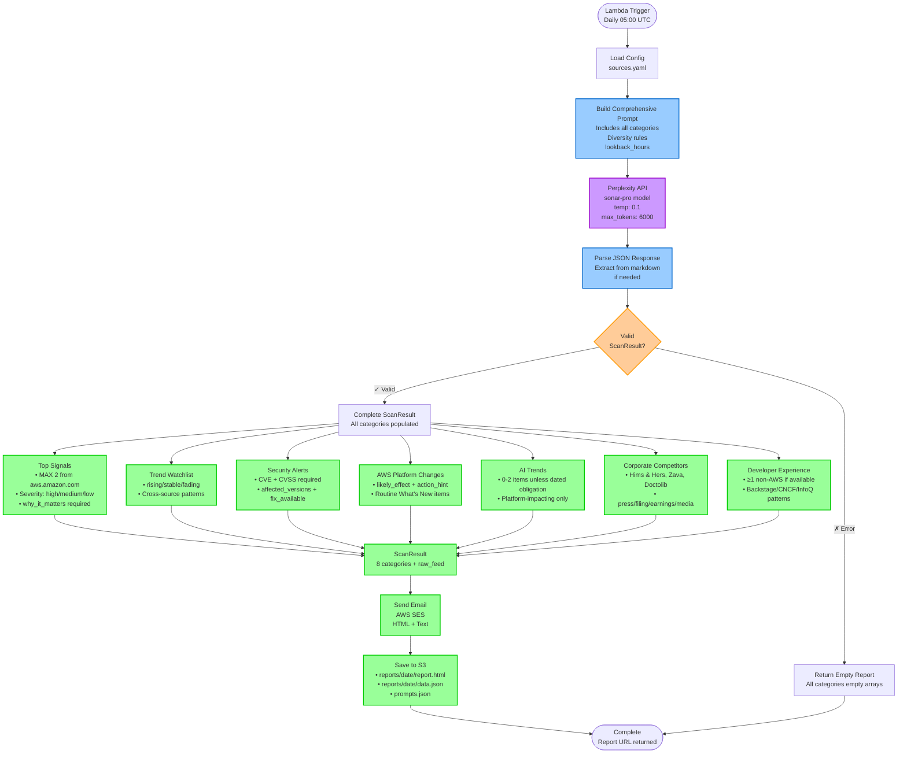

# Me2resh Daily - Executive Intelligence Scan

AI-powered serverless scanner that uses Perplexity (sonar-pro) to research and aggregate healthcare tech, AWS platform updates, and security insights into daily executive reports with archived web access.

## Overview

This application is designed for Director-level technical leadership (Platform & Architecture) to stay informed on:

- AI in healthcare and general platform impact
- Serverless & AWS platform updates
- FHIR / HL7 / interoperability standards
- Security advisories and vulnerabilities
- Corporate intelligence (configurable)
- Developer experience and engineering trends

## Architecture

### High-Level Data Flow

**Simplified View (Perplexity-Only Mode):**
```
Perplexity Research ──→ Structured JSON Response ──→ Email → S3 Archive
(sonar-pro model)        (Complete ScanResult)             (HTML + JSON)
```

### Detailed Data Flow (Perplexity-Only Architecture)



### Key Filtering & Prioritization Mechanisms (Built into Perplexity Prompt)

| Stage | Filter/Mechanism | Purpose | Details |
|-------|------------------|---------|---------|
| **1. Temporal** | `lookback_hours` | Freshness | AWS/Security: 24-48h, Others: up to 72h (configurable) |
| **2. Source Priority** | Ordered source list | Quality control | AWS, Security, DX, Healthtech, Competitors, AI (in order) |
| **3. Source Blacklist** | Noise filtering | Remove low-value sources | serverlessland contributors, youtube, tomsguide, status pages |
| **4. Healthcare Cap** | 40% max combined | Prevent medical bias | Healthcare (AI+FHIR) ≤ 40% of total items |
| **5. AWS Cap (top_signals)** | MAX 2 from aws.amazon.com | Prevent AWS flooding | Forces diversity in critical signals |
| **6. Non-AWS Requirement** | ≥1 from DX or Security | Balanced signals | Ensures top_signals includes non-AWS perspectives |
| **7. Category Limits** | Max 5 per category | Signal vs noise | Independent limits for each section |
| **8. AI Trends Cap** | 0-2 items unless dated | Platform focus | Only platform-impacting or regulatory with dates |
| **9. Severity Scoring** | High/Medium/Low | Impact assessment | High: compliance, breaking changes, exploits |
| **10. Impact Tagging** | 8 impact categories | Business context | Regulatory, Platform, Security, DX, Cost, Org/Strategy, Healthtech, AI |
| **11. Title Normalization** | Consistent format | Clarity | CVE format, version-only releases standardized |
| **12. why_it_matters Template** | Required format | Actionable insight | "{who} because {what} which {so_what}" |
| **13. Ranking Signals** | Additive scoring | Prioritization | +3 for dated changes, +2 for primary sources, +1 for cost/perf |
| **14. Placement Rules** | Category routing | Proper organization | Routine AWS → aws_platform_changes, not top_signals |
| **15. Validation Guards** | Post-processing checks | Data quality | No empty why_it_matters, all URLs must be real, CVE fields required |

### Data Flow Example (Perplexity-Only Mode)

```
INPUT:
  Comprehensive prompt sent to Perplexity (sonar-pro)
  - Lookback: 24 hours (AWS/Security) to 72 hours (others)
  - 9 source categories specified
  - Diversity rules embedded in prompt
  - Complete JSON schema requested

PERPLEXITY RESEARCH & CATEGORIZATION:
  Perplexity researches from primary sources:
  1. AWS What's New, AWS blogs, ALAS
  2. NVD, CISA KEV, GitHub Advisory DB
  3. Backstage, InfoQ, The New Stack, CNCF
  4. MHRA, EMA, FDA, NHS England, HL7
  5. Investors.hims.com, SEC filings, UK competitors
  6. OpenAI/Anthropic blogs, Bedrock, NEJM AI

  Perplexity applies built-in filters:
  - AWS Cap Check: MAX 2 in top_signals from aws.amazon.com ✓
  - Healthcare Cap Check: ≤40% combined (AI + FHIR) ✓
  - Non-AWS Requirement: ≥1 from DX or Security in top_signals ✓
  - Category Limits: MAX 5 items per category ✓
  - AI Trends: 0-2 items (platform-impacting only) ✓

  Returns structured JSON directly:
  → Top Signals: 5 items
     • AWS x2 (Lambda pricing change, ALAS security bulletin)
     • Security x2 (npm CVE-2025-1234, Go stdlib CVE-2025-5678)
     • DX x1 (Backstage golden paths - ensures ≥1 non-AWS)
  → Trend Watchlist: 3 items (cross-source emerging patterns)
  → Security Alerts: 5 items (normalized with CVSS)
     • "npm: CVE-2025-1234 prototype pollution allows RCE (CVSS 9.1)"
     • "Go stdlib: CVE-2025-5678 path traversal (CVSS 7.5)"
  → AWS Platform Changes: 5 items (routine What's New)
     • Lambda runtime update, DynamoDB pricing, IAM policy, CloudWatch metric
  → AI Trends: 2 items
     • AWS Bedrock cost optimization, EU AI Act deadline 2025-08-02
  → Corporate Competitors: 3 items
     • Hims & Hers Q4 earnings, Doctolib Series F funding, Zava UK expansion
  → Developer Experience: 5 items (≥1 non-AWS)
     • Backstage plugin, InfoQ article, DORA metrics, CNCF pattern, NestJS release
  → Raw Feed: 28 items (all sources used in categorization)

OUTPUT:
  Email: HTML report sent via SES
  S3: reports/2025-10-22/report.html + data.json + prompts.json
  Total items in report: 28 across 8 categories
  Healthcare items: 4 (14% of total - well under 40% cap)
  Execution time: ~15-30 seconds (vs 90-120s for old RSS + ChatGPT)
```

### Code Architecture

Built following clean architecture principles with clear separation of concerns:

```
src/
├── domain/           # Domain models and interfaces (ScanResult, TopSignal, etc.)
├── application/      # Business logic (ScanService, ResearchService)
├── infrastructure/   # External integrations (Email, Perplexity, S3 Storage)
├── command/lambda/   # Lambda handlers (daily-scan.ts)
└── utils/            # Shared utilities (logger, config loader, url-validator)
```

## Features

- **Perplexity-Only Architecture**: Single API call to sonar-pro returns complete structured report
- **YAML-based configuration**: Easily maintain settings without code changes
- **Scheduled execution**: Daily scans at configurable times via EventBridge
- **Email delivery**: HTML and text email reports via Amazon SES
- **Web Archive**: All reports stored in public S3 bucket (HTML + JSON) with direct browser access
- **AI-Powered Research**: Perplexity (sonar-pro) researches from primary sources and applies filters
- **Comprehensive Coverage**: 9 source categories (AWS, Security, DX, Healthtech, Competitors, AI, FinOps, Leadership, Emerging Tech)
- **Built-in Diversity**: Embedded rules prevent AWS/healthcare dominance
- **Severity classification**: Automatic high/medium/low severity mapping
- **Impact categorization**: Regulatory, Platform, Security, DX, Cost, Org/Strategy, Healthtech, AI (8 categories)
- **Category Limits**: Maximum 5 items per category for focused, actionable insights
- **Fast Execution**: ~15-30 seconds (vs 90-120s for old RSS + ChatGPT pipeline)

## Prerequisites

- AWS CLI configured with appropriate credentials
- AWS SAM CLI installed
- Node.js 18.x or later
- Verified email addresses in Amazon SES (for sending/receiving emails)
- Perplexity API key (**required** - get it from https://www.perplexity.ai/settings/api)

## Configuration

### 1. Email Setup

Before deploying, verify your email addresses in Amazon SES:

```bash
aws ses verify-email-identity --email-address your-from-address@example.com
aws ses verify-email-identity --email-address your-to-address@example.com
```

Check verification status:

```bash
aws ses get-identity-verification-attributes --identities your-from-address@example.com
```

### 2. Source Configuration

All configuration is managed through `layer-config/config/sources.yaml`. This single file controls:

**Basic Settings:**
- Email addresses (supports environment variables)
- Scan schedule and timezone
- **Lookback hours** (freshness window - default: 24 hours for daily scans)
- Max items per source (20 items default)

**Diversity & Rebalancing Controls:**
- **Max items per category**: 5 (hard cap for each section)
- **Healthcare combined cap**: 40% maximum (prevents medical content dominance)
- **AWS top_signals cap**: MAX 2 from aws.amazon.com (prevents AWS flooding)
- **Non-AWS requirement**: ≥1 from DX/Security in top_signals if available
- **Rebalance mode**: Enabled (automatically balances skewed input)
- **Primary sources first**: Enabled (prioritizes official sources)
- **Drop undated commentary**: Enabled (filters noise)
- **Source blacklist**: serverlessland.com/contributors/*, youtube.com/*, tomsguide.com/*, generic status pages

**RSS Feeds:**
- 41+ pre-configured RSS sources across 7 categories
- Add/remove sources without code changes
- Title-based deduplication to prevent duplicate stories from different sources

**Perplexity Research:**
- Research topics and categories (7 categories covering AI healthcare, FHIR, AWS, security, etc.)
- Sources to prioritize for each topic
- What information to extract
- Override lookback hours for web research (optional)

Example configuration:

```yaml
email:
  to_address: "${TO_EMAIL_ADDRESS}"
  from_address: "${FROM_EMAIL_ADDRESS}"
  subject_prefix: "Me2resh Daily"

scan_config:
  timezone: "Europe/London"
  lookback_hours: 24  # Default: 24 hours for daily scans (override via Lambda event for testing)
  enable_perplexity_research: true

perplexity_research:
  enabled: true
  # lookback_hours: 48  # Uncomment to override scan_config
  research_topics:
    - category: "AI in Healthcare & Clinical AI"
      sources:
        - "FDA AI/ML SaMD guidance and draft documents"
        - "EU AI Act official timeline and GPAI obligations"
        - "NEJM AI, npj Digital Medicine, Lancet Digital Health"
      extract:
        - "Regulatory guidance with effective dates"
        - "Clinical AI safety standards and validation frameworks"
        - "High-risk medical device classifications"

    - category: "FHIR, HL7, and Healthcare Interoperability"
      sources:
        - "HL7 official blog and HL7 News publication"
        - "NHS England Digital FHIR APIs"
      extract:
        - "FHIR ballot updates and implementation guides"
        - "NHS API changes and interoperability guidance"

    # Add more research topics as needed...
```

**How it works:**
1. Edit `sources.yaml` to add/modify research topics
2. The app automatically builds Perplexity query from your config at runtime
3. No code changes needed - just update YAML and redeploy
4. The dynamic prompt includes all categories, sources, and extraction requirements

## Installation

1. Clone the repository:

```bash
cd me2resh-daily
```

2. Install dependencies:

```bash
npm install
```

3. Build the application:

```bash
npm run build
```

## Deployment

### Using SAM CLI

1. Build the SAM application:

```bash
sam build
```

2. Deploy with guided prompts:

```bash
sam deploy --guided
```

You'll be prompted for:
- Stack name (e.g., `me2resh-daily-stack`)
- AWS Region (e.g., `eu-west-2`)
- ToEmailAddress (email to receive reports)
- FromEmailAddress (verified SES email to send from)
- PerplexityApiKey (your Perplexity API key - will be hidden)
- EnableUrlValidation (default: `false` - optional domain allowlist and HTTP validation)

3. For subsequent deployments:

```bash
sam build && sam deploy
```

### Manual Deployment Parameters

```bash
sam deploy \
  --stack-name me2resh-daily-stack \
  --parameter-overrides \
    ToEmailAddress=recipient@example.com \
    FromEmailAddress=sender@example.com \
    PerplexityApiKey=pplx-your-api-key-here \
    EnableUrlValidation=false \
  --capabilities CAPABILITY_IAM \
  --region eu-west-2
```

### URL Validation (Optional Feature)

By default, URL validation is **disabled** (`EnableUrlValidation=false`) for faster processing and broader source coverage.

**When disabled** (recommended):
- All RSS feed URLs are accepted without domain allowlist checking
- No HTTP HEAD/GET validation performed
- Faster scan execution (saves ~30-60 seconds per scan)
- More flexibility to add new sources without updating code

**When enabled** (`EnableUrlValidation=true`):
- Only domains in the curated allowlist are accepted (see `src/utils/url-validator.ts`)
- HTTP HEAD/GET check verifies each URL is accessible
- Provides additional quality control and link integrity
- Useful for production environments with strict quality requirements

To enable URL validation after deployment:
```bash
sam deploy --parameter-overrides EnableUrlValidation=true
```

## Schedule Configuration

The application uses CloudWatch Events (EventBridge) cron expressions:

- **Daily at 5:00 AM UTC**: `cron(0 5 * * ? *)`
- **Daily at 9:00 AM UTC**: `cron(0 9 * * ? *)`
- **Weekdays at 6:00 AM UTC**: `cron(0 6 ? * MON-FRI *)`

Note: CloudWatch Events uses UTC. Adjust for your timezone accordingly.

## Report Archive (S3 Storage)

All generated reports are automatically stored in a public S3 bucket for permanent web access.

### Storage Structure

```
s3://me2resh-daily-scan/
├── index.html                      # Always shows latest report
└── reports/
    ├── 2025-10-19/
    │   ├── report.html            # Viewable in browser
    │   ├── data.json              # Original ScanResult data
    │   └── prompts.json           # Perplexity + ChatGPT prompts
    ├── 2025-10-20/
    │   ├── report.html
    │   ├── data.json
    │   └── prompts.json
    └── ...
```

### Accessing Reports

**Latest Report**: https://me2resh-daily-scan.s3.eu-west-1.amazonaws.com/index.html

**Specific Date**: https://me2resh-daily-scan.s3.eu-west-1.amazonaws.com/reports/2025-10-19/report.html

**JSON Data**: https://me2resh-daily-scan.s3.eu-west-1.amazonaws.com/reports/2025-10-19/data.json

**Prompts**: https://me2resh-daily-scan.s3.eu-west-1.amazonaws.com/reports/2025-10-19/prompts.json

### Features

- **Public Access**: No authentication required - share links directly
- **Permanent Storage**: Reports kept forever (no lifecycle policy)
- **Triple Format**: HTML for viewing, JSON for programmatic access, prompts.json for debugging
- **Email Integration**: Every email includes a "View this report online" footer link
- **Same Styling**: Web reports use identical styling to email for consistency
- **Prompt Transparency**: Every scan saves the exact Perplexity query and ChatGPT prompts (system + user) for debugging and refinement

### Use Cases

- Share specific reports with stakeholders via direct link
- Build custom dashboards using the JSON API
- Historical analysis and trend tracking
- Offline access to past reports
- Integration with BI tools or data pipelines
- **Debug and refine prompts** by examining `prompts.json` to see exactly what was sent to Perplexity and ChatGPT

## Testing

### Testing via Lambda Console

You can invoke the Lambda function directly from the AWS Console with custom `lookback_hours` for testing:

**Test with default 24 hours (scheduled event format):**
```json
{
  "version": "0",
  "id": "test-event",
  "detail-type": "Scheduled Event",
  "source": "aws.events",
  "time": "2025-10-18T05:00:00Z",
  "region": "eu-west-2"
}
```

**Test with 30 days of history:**
```json
{
  "lookback_hours": 720
}
```

**Test with 7 days of history:**
```json
{
  "lookback_hours": 168
}
```

The `lookback_hours` parameter overrides the default from `sources.yaml`, useful for:
- Initial testing with more historical data
- Catching up after downtime
- Testing different time windows

### Testing Locally with SAM

```bash
sam local invoke DailyScanFunction --event events/test-30days.json
```

Create `events/test-30days.json`:
```json
{
  "lookback_hours": 720
}
```

### Run unit tests

```bash
npm test
```

## Development

### Linting

```bash
npm run lint
npm run eslint-fix
```

### Adding New Sources

1. Edit `config/sources.yaml`
2. Add source under the appropriate topic
3. Specify source type (`rss`, `html`, `github_releases`, etc.)
4. Redeploy: `sam build && sam deploy`

### Implementing Source Fetchers

The application includes placeholder implementations in `src/infrastructure/source-fetcher.ts`. To implement actual fetching:

1. Add required dependencies (e.g., `rss-parser`, `cheerio`, `@octokit/rest`)
2. Implement the corresponding fetch method
3. Parse and return `RawFeed[]` data

Example for RSS:

```typescript
private async fetchRssFeed(source: Source, lookbackHours: number): Promise<RawFeed[]> {
    const Parser = require('rss-parser');
    const parser = new Parser();
    const feed = await parser.parseURL(source.rss_url || source.url);

    return feed.items.map(item => ({
        title: item.title,
        source: source.name,
        source_url: item.link,
        published_at: new Date(item.pubDate).toISOString().split('T')[0]
    }));
}
```

## Monitoring

### CloudWatch Logs

View Lambda execution logs:

```bash
sam logs -n DailyScanFunction --stack-name me2resh-daily-stack --tail
```

### Metrics

The function includes AWS X-Ray tracing. View traces in the AWS X-Ray console.

## Troubleshooting

### Email not sending

1. Verify SES email identities:
   ```bash
   aws ses list-identities
   aws ses get-identity-verification-attributes --identities your-email@example.com
   ```

2. Check SES sending limits (sandbox vs production)
3. Review CloudWatch Logs for errors

### Lambda timeout

- Default timeout: 15 minutes (900 seconds)
- Adjust in `template.yaml` under `Globals.Function.Timeout`

### Configuration not loading

- Ensure `config/sources.yaml` is included in the deployment package
- Check CloudWatch Logs for configuration errors
- Verify environment variables are set correctly

## Security Considerations

- **SES Permissions**: Lambda has minimal SES permissions (send only)
- **Secrets**: Use AWS Secrets Manager or Parameter Store for sensitive data
- **IAM Roles**: Follows principle of least privilege
- **Input Validation**: Validate all external source data before processing

## Cost Estimation

Estimated monthly costs (as of 2025-10):

- Lambda: $0.10 (daily 30-second execution at 512MB - much faster than old architecture)
- SES: $0.10 (30 emails/month)
- S3 Storage: $0.05 (1-2GB reports storage)
- S3 Requests: $0.01 (PUT operations for daily uploads)
- CloudWatch Logs: $0.20 (minimal log storage)
- EventBridge: Free (included in AWS Free Tier)
- **Perplexity API (sonar-pro)**: ~$1.98/month (1 comprehensive search per day)
  - Input: ~2,500 tokens/day × 30 days = 75K tokens/month × $3/1M = $0.23
  - Output: ~2,900 tokens/day × 30 days = 87K tokens/month × $15/1M = $1.31
  - Citations: ~400 tokens/day × 30 days = 12K tokens/month × $3/1M = $0.04
  - Buffer for variable content: +$0.40
  - **Total Perplexity**: ~$1.98/month

**Total**: ~$2.44/month

**Comparison with previous architecture:**
- Old (RSS + ChatGPT): ~$2.66-4.46/month, 90-120s execution time
- New (Perplexity-only): ~$2.44/month, 15-30s execution time
- **Savings**: ~$0.22-2.02/month (8-45% cheaper) + 75% faster

Note:
- sonar-pro costs ~16.5× more than sonar per token but provides much higher quality
- Total cost still very affordable (<$30/year)
- Execution time reduction saves Lambda costs
- Alternative: Switch to sonar model for ~$0.12/month (vs $1.98) if budget is critical

## Future Enhancements

- [x] ~~Implement AI/LLM integration for content analysis~~ ✅ (Perplexity sonar-pro)
- [x] ~~Web archive with S3 storage for historical reports~~ ✅
- [x] ~~Category-based organization with top 5 items per section~~ ✅
- [x] ~~Migrate from RSS + ChatGPT to Perplexity-only for faster, simpler execution~~ ✅
- [ ] Implement retry logic for Perplexity API rate limits
- [ ] Add webhook support for real-time alerts
- [ ] Create interactive dashboard for historical scan results (using S3 JSON data)
- [ ] Implement trend analysis across multiple scans
- [ ] Add Slack/Teams integration as alternative to email
- [ ] Add search functionality to web archive
- [ ] Export reports to PDF format
- [ ] Experiment with claude-3-5-sonnet-latest for research (if Perplexity quality degrades)
- [ ] Add configurable prompt templates in YAML (vs hardcoded in ResearchService)

## License

MIT

## Author

Ahmed Mohamed

## Support

For issues and questions, please open an issue in the repository.
