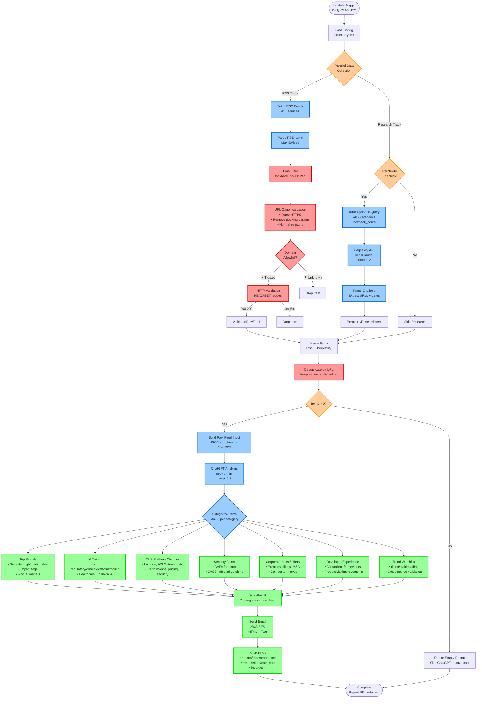

# Me2resh Daily - Executive Intelligence Scan

AI-powered serverless scanner that aggregates healthcare tech, AWS platform updates, and security insights from 41+ sources into daily executive reports with archived web access.

## Overview

This application is designed for Director-level technical leadership (Platform & Architecture) to stay informed on:

- AI in healthcare and general platform impact
- Serverless & AWS platform updates
- FHIR / HL7 / interoperability standards
- Security advisories and vulnerabilities
- Corporate intelligence (configurable)
- Developer experience and engineering trends

## Architecture

### High-Level Data Flow

**Simplified View:**
```
RSS Feeds (41+ sources) ──┐
                          ├──→ Merge → ChatGPT Analysis → Email → S3 Archive
Perplexity Research ──────┘                                      (HTML + JSON)
(ONE combined query)
```

### Detailed Data Flow with Filtering & Prioritization



### Key Filtering & Prioritization Mechanisms

| Stage | Filter/Mechanism | Purpose | Details |
|-------|------------------|---------|---------|
| **1. Temporal** | `lookback_hours` | Freshness | Default 24h, configurable via Lambda event |
| **2. Volume Control** | Max items per source | Cost optimization | 20 items per RSS feed, 50 parsed max |
| **3. URL Canonicalization** | Normalize URLs | Deduplication | HTTPS, remove tracking params, normalize paths |
| **4. Domain Allowlist** | Trusted sources only | Quality control | Optional (disabled by default): AWS, HL7, FDA, MHRA, GitHub, etc. |
| **5. HTTP Validation** | URL accessibility | Link integrity | Optional (disabled by default): HEAD/GET check, 10s timeout, 200-299 status |
| **6. Deduplication** | By canonical URL | Avoid redundancy | Keep item with earlier published_at |
| **7. Diversification** | Cross-category balance | Comprehensive coverage | ChatGPT instructed to populate ALL categories |
| **8. Healthcare Cap** | 40% max combined | Prevent medical bias | Healthcare (AI+FHIR) ≤ 40% of total items |
| **9. Priority Order** | Topic-based ranking | Executive focus | AWS/DX first, then security, then healthcare |
| **10. Severity Scoring** | High/Medium/Low | Impact assessment | High: compliance, breaking changes, exploits |
| **11. Impact Tagging** | 6 impact categories | Business context | Regulatory, Platform, Security, DX, Cost, Org/Strategy |
| **12. Category Limits** | Max 5 per category | Signal vs noise | Independent limits, not 5 total across all |
| **13. URL Integrity** | Source validation | No hallucination | All URLs must exist in raw_feed_input |
| **14. Empty Check** | Skip if no items | Cost optimization | Avoid ChatGPT call on empty input |

### Data Flow Example (48 Items → Final Report)

```
INPUT:
  RSS Feeds: 45 items (after time filtering from 200+ parsed)
  Perplexity: 8 items (citations from combined query)
  Total: 53 items

FILTERING:
  ✓ Domain allowlist: 53 → 50 (3 unknown domains dropped)
  ✓ HTTP validation: 50 → 48 (2 broken links dropped)
  ✓ Deduplication: 48 → 45 (3 URL duplicates merged)

CHATGPT CATEGORIZATION (45 unique items):
  Priority Order Applied:
  1. AWS/Serverless: 5 items selected first
  2. Developer Experience: 5 items selected second
  3. Security: 5 items selected third
  4. AI (platform-impacting): 3 items selected
  5. FHIR/Interop: 2 items selected
  6. Corporate: 2 items selected

  Healthcare Cap Check: (3 AI + 2 FHIR) / 22 total = 23% ✓ (under 40% limit)

  Final Distribution:
  → Top Signals: 5 items (AWS x2, Security x2, DX x1 - prioritized by impact)
  → AWS Platform Changes: 5 items (Lambda, EventBridge, DynamoDB, IAM, CloudWatch)
  → Developer Experience: 5 items (Backstage, platform engineering, DORA metrics)
  → Security Alerts: 5 items (CVEs for npm, Go, PHP + AWS ALAS)
  → AI Trends: 3 items (Bedrock, model serving, regulatory deadline)
  → Trend Watchlist: 5 items (rising DX trends, AWS adoption patterns)
  → Corporate Hims & Hers: 2 items (earnings, product launch)

OUTPUT:
  Email: HTML report sent via SES
  S3: reports/2025-10-20/report.html + data.json + prompts.json
  Total items in report: 30 (from 45 analyzed, from 53 collected)
  Healthcare items: 5 (17% of total - well under 40% cap)
```

### Code Architecture

Built following clean architecture principles with clear separation of concerns:

```
src/
├── domain/           # Domain models and interfaces
├── application/      # Business logic (ScanService, ResearchService)
├── infrastructure/   # External integrations (Email, HTTP, Perplexity, OpenAI)
├── command/lambda/   # Lambda handlers
└── utils/            # Shared utilities (logger, config loader)
```

## Features

- **Hybrid Data Collection**: Combines RSS feeds (41+ sources) with Perplexity web research for maximum coverage
- **YAML-based configuration**: Easily maintain sources and topics without code changes
- **Scheduled execution**: Daily scans at configurable times via EventBridge
- **Email delivery**: HTML and text email reports via Amazon SES
- **Web Archive**: All reports stored in public S3 bucket (HTML + JSON) with direct browser access
- **AI-Powered Analysis**: ChatGPT (gpt-4o-mini) categorizes and summarizes updates
- **Web Research**: Perplexity API covers topics without RSS feeds (regulatory updates, competitive intelligence)
- **URL Validation**: HTTP HEAD checks ensure all links are working before analysis
- **Severity classification**: Automatic high/medium/low severity mapping
- **Impact categorization**: Regulatory, Platform, Security, DX, Cost, Org/Strategy
- **Category Limits**: Maximum 5 items per category for focused, actionable insights

## Prerequisites

- AWS CLI configured with appropriate credentials
- AWS SAM CLI installed
- Node.js 18.x or later
- Verified email addresses in Amazon SES (for sending/receiving emails)
- OpenAI API key (for ChatGPT analysis)
- Perplexity API key (optional, for web research - get it from https://www.perplexity.ai/settings/api)

## Configuration

### 1. Email Setup

Before deploying, verify your email addresses in Amazon SES:

```bash
aws ses verify-email-identity --email-address your-from-address@example.com
aws ses verify-email-identity --email-address your-to-address@example.com
```

Check verification status:

```bash
aws ses get-identity-verification-attributes --identities your-from-address@example.com
```

### 2. Source Configuration

All configuration is managed through `layer-config/config/sources.yaml`. This single file controls:

**Basic Settings:**
- Email addresses (supports environment variables)
- Scan schedule and timezone
- **Lookback hours** (freshness window - default: 24 hours for daily scans)
- Max items per source (20 items default)

**Diversity & Rebalancing Controls:**
- **Max items per category**: 5 (hard cap for each section)
- **Healthcare combined cap**: 40% maximum (prevents medical content dominance)
- **Rebalance mode**: Enabled (automatically balances skewed input)
- **Primary sources first**: Enabled (prioritizes official sources)
- **Drop undated commentary**: Enabled (filters noise)

**RSS Feeds:**
- 41+ pre-configured RSS sources across 7 categories
- Add/remove sources without code changes
- Title-based deduplication to prevent duplicate stories from different sources

**Perplexity Research:**
- Research topics and categories (7 categories covering AI healthcare, FHIR, AWS, security, etc.)
- Sources to prioritize for each topic
- What information to extract
- Override lookback hours for web research (optional)

Example configuration:

```yaml
email:
  to_address: "${TO_EMAIL_ADDRESS}"
  from_address: "${FROM_EMAIL_ADDRESS}"
  subject_prefix: "Me2resh Daily"

scan_config:
  timezone: "Europe/London"
  lookback_hours: 24  # Default: 24 hours for daily scans (override via Lambda event for testing)
  enable_perplexity_research: true

perplexity_research:
  enabled: true
  # lookback_hours: 48  # Uncomment to override scan_config
  research_topics:
    - category: "AI in Healthcare & Clinical AI"
      sources:
        - "FDA AI/ML SaMD guidance and draft documents"
        - "EU AI Act official timeline and GPAI obligations"
        - "NEJM AI, npj Digital Medicine, Lancet Digital Health"
      extract:
        - "Regulatory guidance with effective dates"
        - "Clinical AI safety standards and validation frameworks"
        - "High-risk medical device classifications"

    - category: "FHIR, HL7, and Healthcare Interoperability"
      sources:
        - "HL7 official blog and HL7 News publication"
        - "NHS England Digital FHIR APIs"
      extract:
        - "FHIR ballot updates and implementation guides"
        - "NHS API changes and interoperability guidance"

    # Add more research topics as needed...
```

**How it works:**
1. Edit `sources.yaml` to add/modify research topics
2. The app automatically builds Perplexity query from your config at runtime
3. No code changes needed - just update YAML and redeploy
4. The dynamic prompt includes all categories, sources, and extraction requirements

## Installation

1. Clone the repository:

```bash
cd me2resh-daily
```

2. Install dependencies:

```bash
npm install
```

3. Build the application:

```bash
npm run build
```

## Deployment

### Using SAM CLI

1. Build the SAM application:

```bash
sam build
```

2. Deploy with guided prompts:

```bash
sam deploy --guided
```

You'll be prompted for:
- Stack name (e.g., `me2resh-daily-stack`)
- AWS Region (e.g., `eu-west-2`)
- ToEmailAddress (email to receive reports)
- FromEmailAddress (verified SES email to send from)
- OpenAIApiKey (your OpenAI API key - will be hidden)
- PerplexityApiKey (optional, for web research)
- EnableUrlValidation (default: `false` - disable domain allowlist and HTTP validation for faster processing)

3. For subsequent deployments:

```bash
sam build && sam deploy
```

### Manual Deployment Parameters

```bash
sam deploy \
  --stack-name me2resh-daily-stack \
  --parameter-overrides \
    ToEmailAddress=recipient@example.com \
    FromEmailAddress=sender@example.com \
    OpenAIApiKey=sk-your-api-key-here \
    PerplexityApiKey=pplx-your-api-key-here \
    EnableUrlValidation=false \
  --capabilities CAPABILITY_IAM \
  --region eu-west-2
```

### URL Validation (Optional Feature)

By default, URL validation is **disabled** (`EnableUrlValidation=false`) for faster processing and broader source coverage.

**When disabled** (recommended):
- All RSS feed URLs are accepted without domain allowlist checking
- No HTTP HEAD/GET validation performed
- Faster scan execution (saves ~30-60 seconds per scan)
- More flexibility to add new sources without updating code

**When enabled** (`EnableUrlValidation=true`):
- Only domains in the curated allowlist are accepted (see `src/utils/url-validator.ts`)
- HTTP HEAD/GET check verifies each URL is accessible
- Provides additional quality control and link integrity
- Useful for production environments with strict quality requirements

To enable URL validation after deployment:
```bash
sam deploy --parameter-overrides EnableUrlValidation=true
```

## Schedule Configuration

The application uses CloudWatch Events (EventBridge) cron expressions:

- **Daily at 5:00 AM UTC**: `cron(0 5 * * ? *)`
- **Daily at 9:00 AM UTC**: `cron(0 9 * * ? *)`
- **Weekdays at 6:00 AM UTC**: `cron(0 6 ? * MON-FRI *)`

Note: CloudWatch Events uses UTC. Adjust for your timezone accordingly.

## Report Archive (S3 Storage)

All generated reports are automatically stored in a public S3 bucket for permanent web access.

### Storage Structure

```
s3://me2resh-daily-scan/
├── index.html                      # Always shows latest report
└── reports/
    ├── 2025-10-19/
    │   ├── report.html            # Viewable in browser
    │   ├── data.json              # Original ScanResult data
    │   └── prompts.json           # Perplexity + ChatGPT prompts
    ├── 2025-10-20/
    │   ├── report.html
    │   ├── data.json
    │   └── prompts.json
    └── ...
```

### Accessing Reports

**Latest Report**: https://me2resh-daily-scan.s3.eu-west-1.amazonaws.com/index.html

**Specific Date**: https://me2resh-daily-scan.s3.eu-west-1.amazonaws.com/reports/2025-10-19/report.html

**JSON Data**: https://me2resh-daily-scan.s3.eu-west-1.amazonaws.com/reports/2025-10-19/data.json

**Prompts**: https://me2resh-daily-scan.s3.eu-west-1.amazonaws.com/reports/2025-10-19/prompts.json

### Features

- **Public Access**: No authentication required - share links directly
- **Permanent Storage**: Reports kept forever (no lifecycle policy)
- **Triple Format**: HTML for viewing, JSON for programmatic access, prompts.json for debugging
- **Email Integration**: Every email includes a "View this report online" footer link
- **Same Styling**: Web reports use identical styling to email for consistency
- **Prompt Transparency**: Every scan saves the exact Perplexity query and ChatGPT prompts (system + user) for debugging and refinement

### Use Cases

- Share specific reports with stakeholders via direct link
- Build custom dashboards using the JSON API
- Historical analysis and trend tracking
- Offline access to past reports
- Integration with BI tools or data pipelines
- **Debug and refine prompts** by examining `prompts.json` to see exactly what was sent to Perplexity and ChatGPT

## Testing

### Testing via Lambda Console

You can invoke the Lambda function directly from the AWS Console with custom `lookback_hours` for testing:

**Test with default 24 hours (scheduled event format):**
```json
{
  "version": "0",
  "id": "test-event",
  "detail-type": "Scheduled Event",
  "source": "aws.events",
  "time": "2025-10-18T05:00:00Z",
  "region": "eu-west-2"
}
```

**Test with 30 days of history:**
```json
{
  "lookback_hours": 720
}
```

**Test with 7 days of history:**
```json
{
  "lookback_hours": 168
}
```

The `lookback_hours` parameter overrides the default from `sources.yaml`, useful for:
- Initial testing with more historical data
- Catching up after downtime
- Testing different time windows

### Testing Locally with SAM

```bash
sam local invoke DailyScanFunction --event events/test-30days.json
```

Create `events/test-30days.json`:
```json
{
  "lookback_hours": 720
}
```

### Run unit tests

```bash
npm test
```

## Development

### Linting

```bash
npm run lint
npm run eslint-fix
```

### Adding New Sources

1. Edit `config/sources.yaml`
2. Add source under the appropriate topic
3. Specify source type (`rss`, `html`, `github_releases`, etc.)
4. Redeploy: `sam build && sam deploy`

### Implementing Source Fetchers

The application includes placeholder implementations in `src/infrastructure/source-fetcher.ts`. To implement actual fetching:

1. Add required dependencies (e.g., `rss-parser`, `cheerio`, `@octokit/rest`)
2. Implement the corresponding fetch method
3. Parse and return `RawFeed[]` data

Example for RSS:

```typescript
private async fetchRssFeed(source: Source, lookbackHours: number): Promise<RawFeed[]> {
    const Parser = require('rss-parser');
    const parser = new Parser();
    const feed = await parser.parseURL(source.rss_url || source.url);

    return feed.items.map(item => ({
        title: item.title,
        source: source.name,
        source_url: item.link,
        published_at: new Date(item.pubDate).toISOString().split('T')[0]
    }));
}
```

## Monitoring

### CloudWatch Logs

View Lambda execution logs:

```bash
sam logs -n DailyScanFunction --stack-name me2resh-daily-stack --tail
```

### Metrics

The function includes AWS X-Ray tracing. View traces in the AWS X-Ray console.

## Troubleshooting

### Email not sending

1. Verify SES email identities:
   ```bash
   aws ses list-identities
   aws ses get-identity-verification-attributes --identities your-email@example.com
   ```

2. Check SES sending limits (sandbox vs production)
3. Review CloudWatch Logs for errors

### Lambda timeout

- Default timeout: 15 minutes (900 seconds)
- Adjust in `template.yaml` under `Globals.Function.Timeout`

### Configuration not loading

- Ensure `config/sources.yaml` is included in the deployment package
- Check CloudWatch Logs for configuration errors
- Verify environment variables are set correctly

## Security Considerations

- **SES Permissions**: Lambda has minimal SES permissions (send only)
- **Secrets**: Use AWS Secrets Manager or Parameter Store for sensitive data
- **IAM Roles**: Follows principle of least privilege
- **Input Validation**: Validate all external source data before processing

## Cost Estimation

Estimated monthly costs (as of 2025):

- Lambda: $0.20 (daily 15-min execution at 512MB)
- SES: $0.10 (30 emails/month)
- S3 Storage: $0.05 (1-2GB reports storage)
- S3 Requests: $0.01 (PUT operations for daily uploads)
- CloudWatch Logs: $0.50 (log storage and insights)
- EventBridge: Free (included in AWS Free Tier)
- **OpenAI API (GPT-4o-mini)**: ~$0.30-0.60/month (for analysis)
- **Perplexity API (sonar)**: ~$1.50-3.00/month (1 search per day)

**Total**: ~$2.66-4.46/month

Note:
- Perplexity is optional - system works with RSS-only mode
- Using GPT-4o instead of GPT-4o-mini would add ~$8-15/month
- Costs scale with the volume of content analyzed

## Future Enhancements

- [x] ~~Implement AI/LLM integration for content analysis using OpenAI ChatGPT API~~ ✅
- [x] ~~Web archive with S3 storage for historical reports~~ ✅
- [x] ~~Category-based organization with top 5 items per section~~ ✅
- [ ] Add support for all source types (RSS, GitHub, NVD, CISA)
- [ ] Implement caching to avoid re-fetching unchanged content
- [ ] Add webhook support for real-time alerts
- [ ] Create interactive dashboard for historical scan results (using S3 JSON data)
- [ ] Implement trend analysis across multiple scans
- [ ] Add Slack/Teams integration as alternative to email
- [ ] Switch to GPT-4o for higher quality analysis when budget allows
- [ ] Implement retry logic for OpenAI API rate limits
- [ ] Add search functionality to web archive
- [ ] Export reports to PDF format

## License

MIT

## Author

Ahmed Mohamed

## Support

For issues and questions, please open an issue in the repository.
